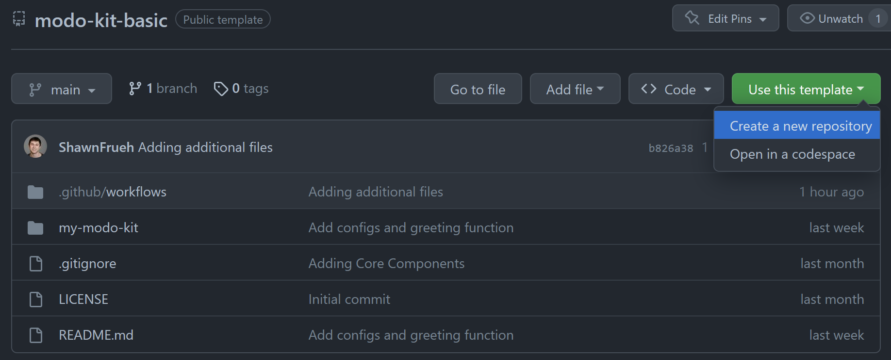
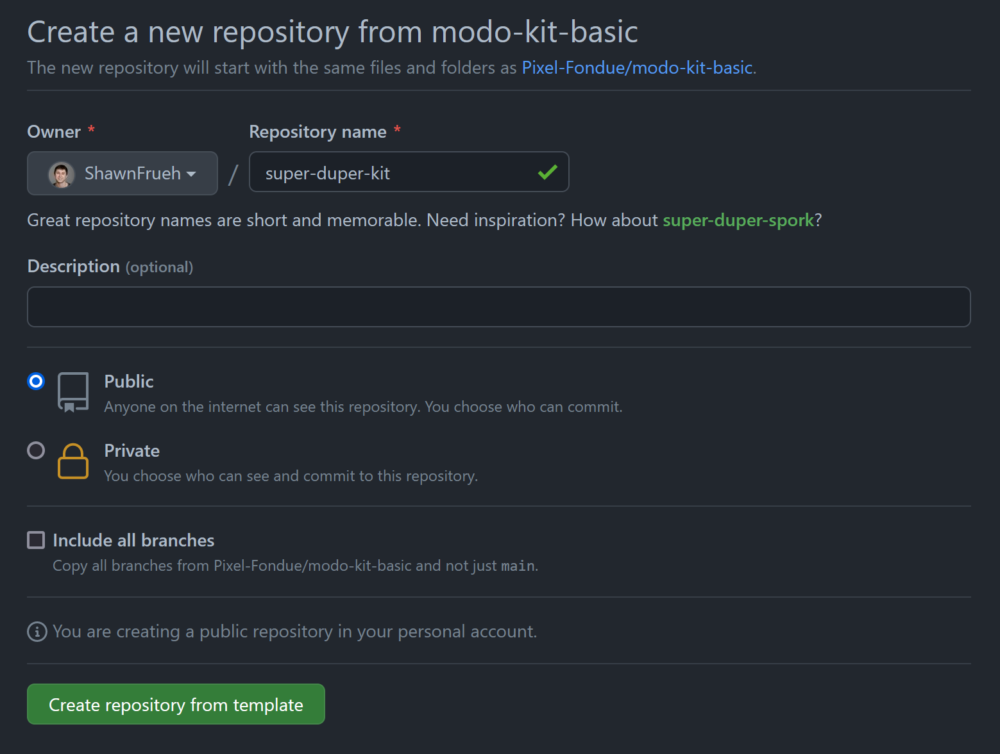
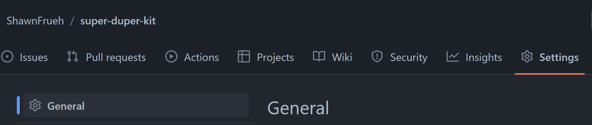
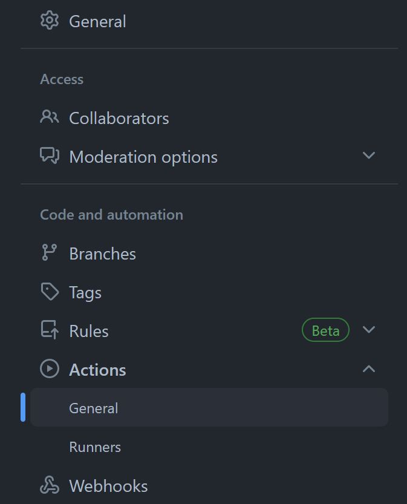
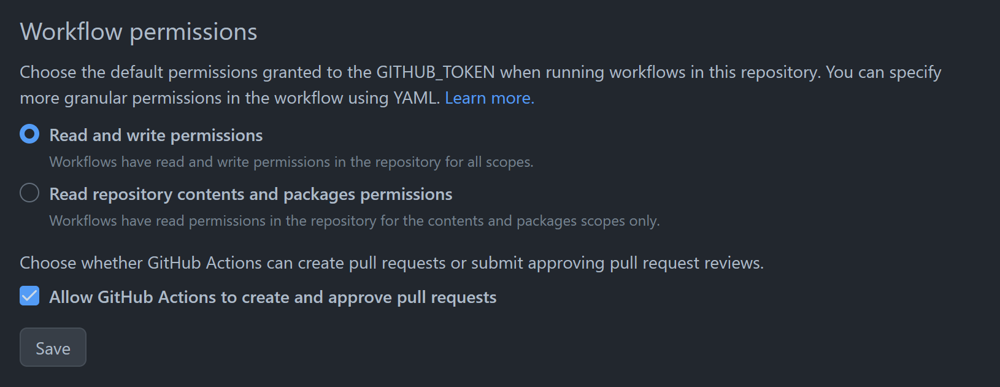
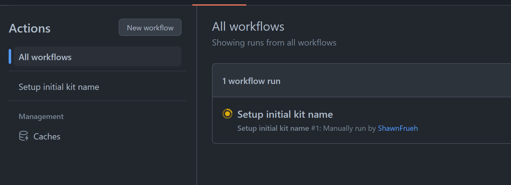
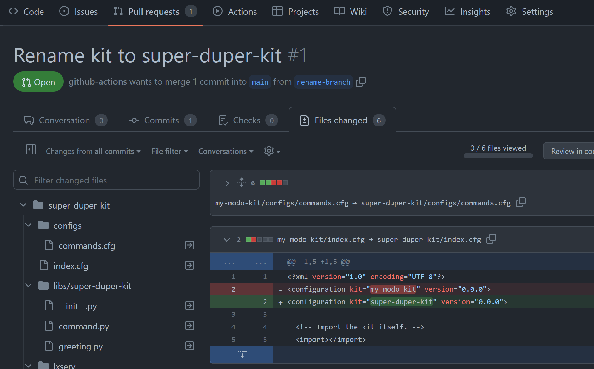
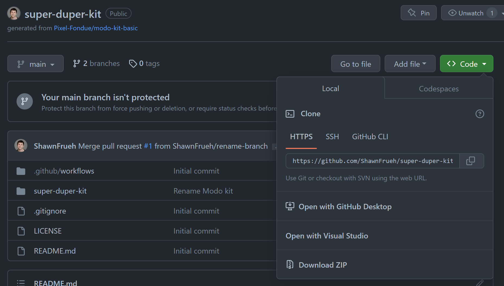

# Generating a New Kit Using This Template Repository

This repository is a pre-configured template repository designed to be a jumping-off point for your new kit creation. It isn't intended for direct usage, but rather as a base to copy into a new repository. Here's a step-by-step guide on how to do this:

### Establishing a New Repository from This Template:

1. **Initiating the Template Process**
   - Click on `Use this template` at the top of this repository and select `Create a new repository`.
      - 
2. **Creating a New Repository**
   - This action opens up a dialog box for creating a new repository within your GitHub account. In this example, we're creating a new kit called `super-duper-kit`. As such, we'll enter this as the repository name.
      - 
3. **Activating the GitHub Actions**
   - After the new repository is up and running, navigate to the settings to enable GitHub Actions.
      - 
   - Follow the route: Settings > Actions > General
      - 
4. **Configuring Action Permissions**
   - Set the Action Permissions to Read/Write and allow for pull requests.
      - 
5. **Running the GitHub Action**
   - Proceed to the Actions tab and execute the `Setup initial kit name` action. You will then be prompted to set the kit name and the kit abbreviation.
      - 
   - The currently running action will display under the `All workflows` section.
      - 
6. **Reviewing and Merging Changes**
   - Once the action workflow concludes, a new Pull Request containing the changes will appear. You can review these alterations and add any additional ones if required.
      - 
   - If all changes are in order, finalize by selecting `Merge Pull Request`.
      - 
7. **Install the Kit**
   - Now that the kit is all setup, lets download the repository using [GitHub Desktop](https://desktop.github.com/) or your preferred Git client. Here you can select `Open with GitHub Desktop`
     - 
   - Once downloaded, everything needed for the kit is in the `super-duper-kit` directory, so we simply copy that over to your kits directory